# AWS VPC and Networking: A Custom Cloud Network 

## Setup Instructions

### Step 1 – Create the VPC 

A VPC called `A1-VPC` with the CIDR block 10.0.0.0/16, providing 65,536 private IP addresses. DNS Resolution is enabled, allowing resources within the VPC to use DNS to resolve domains into IP addresses.

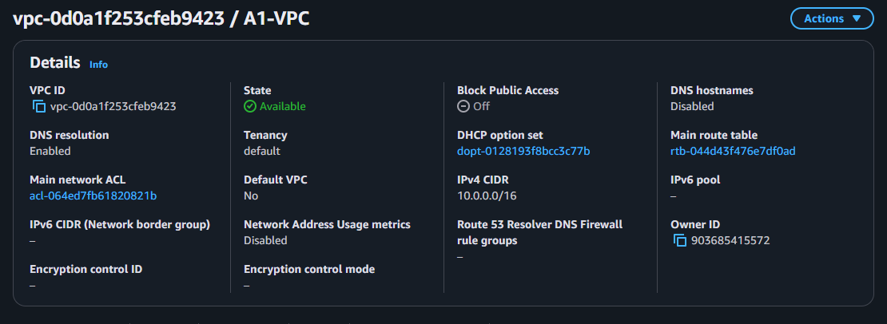

The VPC is a private, isolated network within a cloud provider (such as AWS).

---

### Step 2 – Create the subnets

- `A1-Public-Subnet` with the CIDR block `10.0.0.0/24` residing in `eu-north-1a` Availibility Zone (AZ).
- `A1-Private-Subnet` with the CIDR block `10.0.1.0/24` residing in `eu-north-1b` Availibility Zone (AZ).

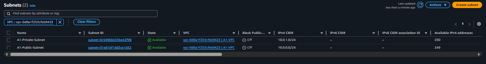

These are smaller networks within the VPC. However, they are not yet truly public or private. Each of them have 256 IP addresses but AWS reserves 5 IPs (for network address, VPC router, DNS, future use a nd broadcast address), so only 251 are usable.

---

### Step 3 – Create and attach the Internet Gateway

Internet Gateway `A1-IGW` attached to `A1-VPC`.

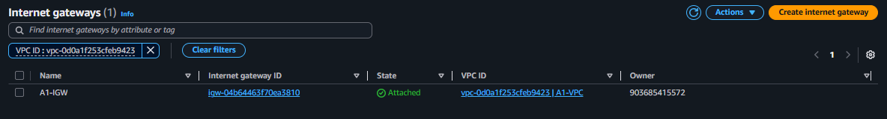

This is what allows the resources within the VPC to send and receive Internet traffic. However, attaching an Internet Gateway alone does not provide internet connectivity until a route table directs traffic to it.

---

### Step 4 - Create the NAT Gateway 

NAT Gateway `A1-NGW` residing in the public subnet, with connectivity type being public and an assigned ELastic IP.

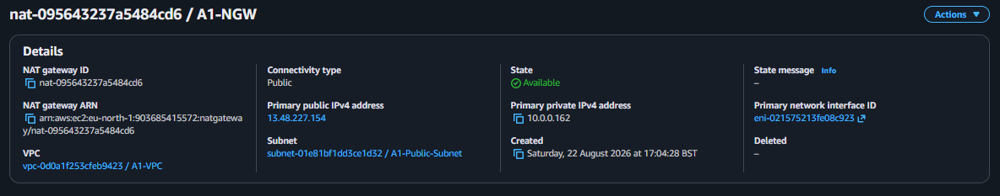

The NAT Gateway allows resources within a private subnet to have outbound connections to the internet while not allowing the internet to initiate connections to the resources. It must reside in the public subnet so it can access the internet through the Internet Gateway. However, it also does not provide internet connectivity until the private subnet's route table directs traffic to it.

---

### Step 5 - Create the route tables

Two route tables, each associated with their own subnet.

- `A1-Public-RT` associated with the public subnet `A1-Public-Subnet`, with:
 - A route with destination `0.0.0.0/0` targeting the Internet Gateway `A1-IGW`.
 - A route with destination `10.0.0.0/16` targeting `local`.
- `A1-Private-RT` associated with the private subnet `A1-Private-Subnet`, with:
 - A route with destination `0.0.0.0/0` targeting the NAT Gateway `A1-NGW`.
 - A route with destination `10.0.0.0/16` targeting `local`.

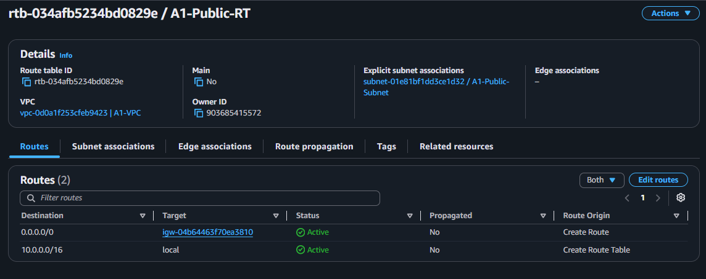

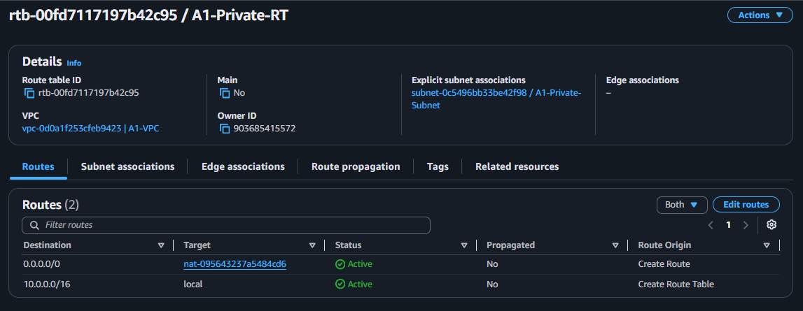

These routes determine where traffic from resources should be sent based on its destination. The `local` target is always present and it is what lets resources within a VPC to communicate with each other.

---

### Step 6 - Create the Security Groups

Two Security Groups, one for each EC2 instance:

- `A1-Public-EC2-SG` with inbound rules allowing:
 - HTTP (Port 80) traffic from my IP
 - SSH (Port 22) traffic from my IP

- `A1-Private-EC2-SG` with inbound rules allowing:
 - HTTP (Port 80) traffic from the security group `A1-Public-EC2-SG`
 - SSH (Port 22) traffic from the security group `A1-Public-EC2-SG`

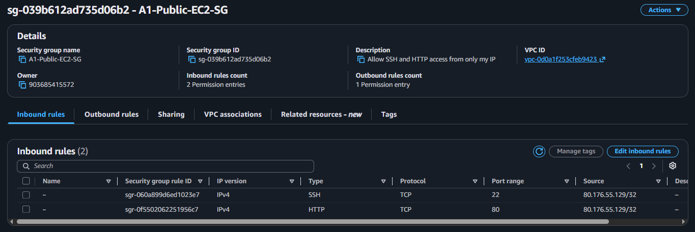

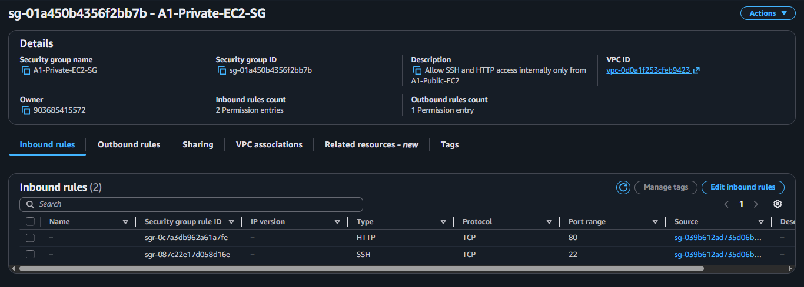

The `A1-Public-EC2-SG` is the security group for the bastion host. The private security group references the bastion's security group not it's IP address. This allows the private instance to be accessed through the bastion even if its IP address changes. This setup follows the principle of least privilege by minimising access to only what is necessary.

---

### Step 7 - Launch the EC2 instances

Two t3.micro EC2 instances using Amazon Linux AMI:

- `A1-Public-EC2` in the public subnet within the `eu-north-1a` AZ with an auto-assigned public IP address. Its security group is `A1-Public-EC2-SG`. This is the bastion host.
- `A1-Private-EC2` in the private subnet within the `eu-north-1b` AZ with no public IP address. Its security group is `A1-Private-EC2-SG`.

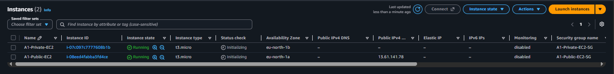

---

### Step 8 - SSH into the bastion 

Connecting to the bastion server from my machine using SSH.

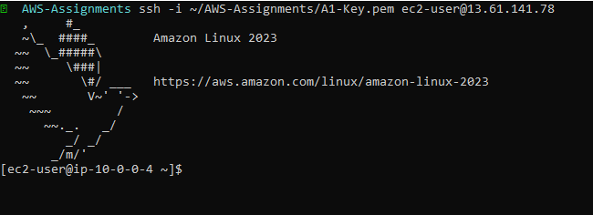

---

### Step 9 - SSH into private EC2 instance from the bastion

Copy the private key into the bastion. From the bastion, SSH into to the private EC2 instance `A1-Private-EC2` using its private IP address.

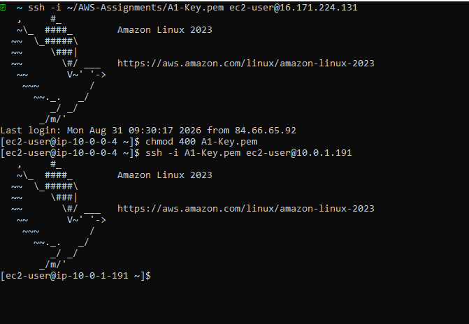

---

