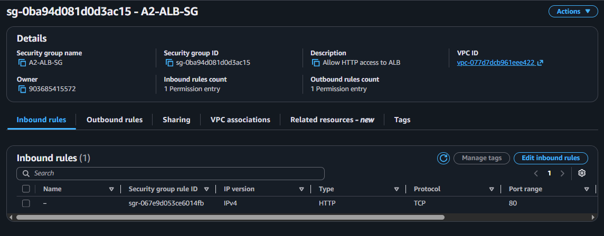
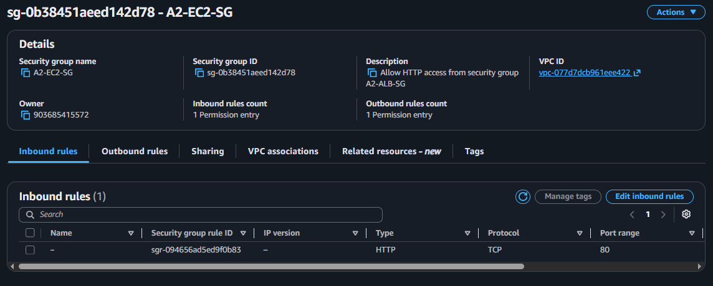

# AWS Application Load Balancer: A Highly Available, Auto-Scaling Web Tier

---
### Setup Instructions
---

## Step 1 – Create Security Groups

### Create the Application Load Balancer Security Group

Create a security group named **`A2-ALB-SG`** with the following inbound rule:

| Type | Protocol | Port | Source |
|------|----------|------|--------|
| HTTP | TCP | 80 | `0.0.0.0/0` |

This allows HTTP traffic from the internet to reach the Application Load Balancer.



---

### Create the EC2 Security Group

Create another security group named **`A2-EC2-SG`** with the following inbound rule:

| Type | Protocol | Port | Source |
|------|----------|------|--------|
| HTTP | TCP | 80 | `A2-ALB-SG` |

This configuration ensures that the EC2 instances only accept HTTP traffic from the Application Load Balancer, rather than directly from the internet.



---

## Step 2 – Launch the EC2 Instances

Launch two Amazon EC2 instances using the **`A2-EC2-SG`** security group.

| Instance Name | Availability Zone | Security Group |
|---------------|-------------------|----------------|
| `A2-EC2-1` | `eu-north-1a` | `A2-EC2-SG` |
| `A2-EC2-2` | `eu-north-1b` | `A2-EC2-SG` |

Each instance uses a User Data script to automatically install the Apache web server and create a simple webpage displaying the instance name. This makes it easy to verify that traffic is being distributed correctly by the load balancer.


---

## Step 3 – Configure User Data

### User Data for `A2-EC2-1`

```bash
#!/bin/bash

yum update -y
yum install -y httpd

systemctl start httpd
systemctl enable httpd

echo "<h1>A2-EC2-1</h1>" > /var/www/html/index.html
```

### User Data for `A2-EC2-2`

Use the same script, but replace the final line with:

```bash
echo "<h1>A2-EC2-2</h1>" > /var/www/html/index.html
```

This creates a unique webpage on each instance, allowing you to identify which EC2 instance is serving requests during load balancing.

> **📸 Screenshot:** User Data section during EC2 instance creation.

---

