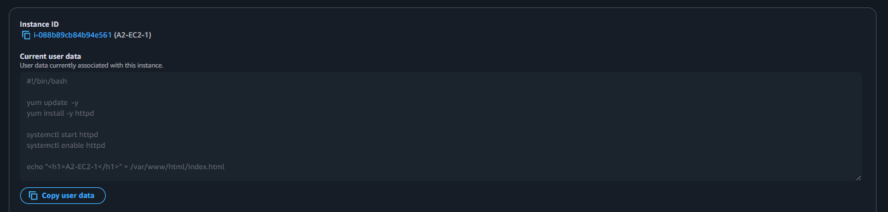
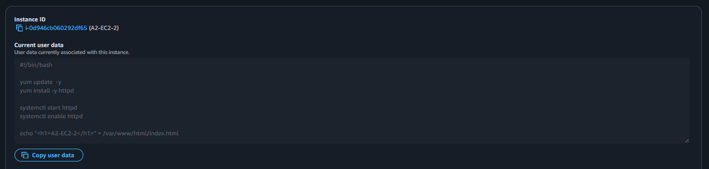
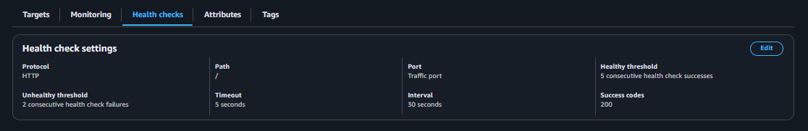
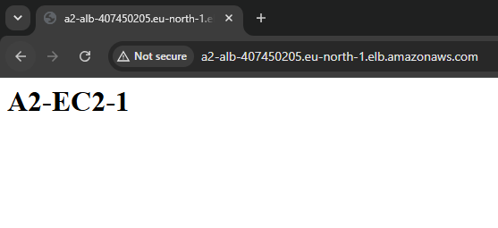
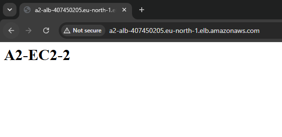

# AWS Application Load Balancer: A Highly Available, Auto-Scaling Web Tier

**Stack**:
- Application Load Balancer - Internet facing Layer 7 Load Balancer 
- Target Group - Collection of instances the ALB forwards traffic to
- Amazon EC2 - `t3.micro` Amazon Linux web server 
- Security Groups - ALB SG open to everyone on the internet on port 80 and EC2 SG open to only the ALB SG on port 80

## Setup Instructions

### Step 1 – Create Security Groups

Two security groups: 

- `A2-ALB-SG` – Allows inbound HTTP (port 80) traffic from 0.0.0.0/0, enabling public access to the load balancer over the internet.
- `A2-EC2-SG` – Security group for the EC2 instances, configured to allow inbound HTTP (port 80) traffic only from `A2-ALB-SG`


`A2-EC2-SG` ensures that the instances only accept HTTP traffic from the Application Load Balancer, rather than directly from the internet.

---

### Step 2 – Launch the EC2 Instances

Launch two Amazon EC2 instances using the `A2-EC2-SG` security group, with one instance in `eu-north-1a` AZ and the other in `eu-north-1b` AZ,
using the following User Data for both except changing the last line:

```bash
#!/bin/bash

yum update -y
yum install -y httpd

systemctl start httpd
systemctl enable httpd

echo "<h1>A2-EC2-1</h1>" > /var/www/html/index.html
```

For the other instance, change last line to the following 

```bash
echo "<h1>A2-EC2-2</h1>" > /var/www/html/index.html
```

Each instance uses a User Data script to automatically install the Apache web server and create a simple webpage displaying the instance name. This makes it easy to verify that traffic is being distributed correctly by the load balancer.






---

### Step 3 – Create a Target Group

A target group named **`A2-TG`** with target type as instances so the ALB can route requests to the EC2 instances. Also, ensuring the health check protocol is HTTP and the health check path is `/`

After creating the target group, register both EC2 instances: `A2-EC2-1` and `A2-EC2-2`




The health check on the root path (`/`) verifies that the Apache web server is running and responding successfully on each instance.

### Step 4 – Create the Application Load Balancer

An internet-facing Application Load Balancer deployed across two public subnets in separate Availability Zones to provide high availability with a load balancer node in each zone.


This configuration enables the Application Load Balancer to receive HTTP requests from clients and distribute traffic evenly between the registered EC2 instances.

---

### Step 5 – Test Load Balancing

Once the Application Load Balancer has finished provisioning, copy its **DNS name** and open the DNS name in your web browser.

Ensure the request uses HTTP rather than HTTPS if the browser automatically redirects to HTTPS.

Refresh the page several times and you should see the response alternate between:

```text
A2-EC2-1 and A2-EC2-2
```





This confirms that the Application Load Balancer is successfully distributing incoming requests across both EC2 instances.

---


