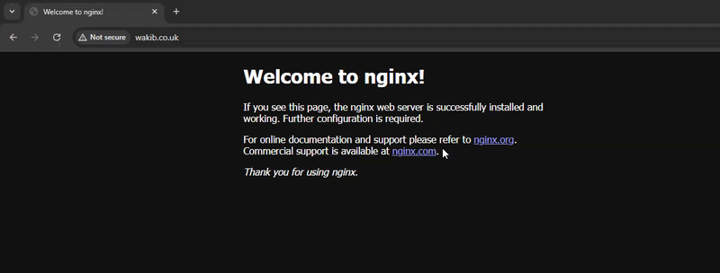

# NGINX Web Server on AWS EC2 with Custom Domain

Deployed a NGINX web server on AWS EC2 and configured DNS (A record) to serve a custom domain using CloudFlare.



## 📌 Overview

This project covers:

Launching an AWS EC2 instance (Ubuntu 24)

Installing and running NGINX

Deploying a website

Connecting a Cloudflare domain to EC2


## 🧰 Tech Stack
AWS EC2 – Virtual server hosting

Ubuntu 24.04 LTS – Operating system

NGINX – Web server

Cloudflare – Domain & DNS management

## 🚀 Setup Instructions

### 1. Launch EC2 Instance (Ubuntu 24)
- Go to AWS Console → EC2 → Launch Instance
- Choose:
  -Ubuntu Server 24.04 LTS
  -Instance type: t2.micro (Free Tier eligible)
- Configure Security Group:
  - Allow:
    - SSH (22)
    -HTTP (80)
- Download .pem key pair

### 2. Connect to EC2

### 3. Update System and Install NGINX

```bash
sudo apt update
sudo apt install nginx
sudo systemctl status nginx # should show "active (running)"
```
If you visit the public IP address of your EC2 instance in the browser, you should now see the NGINX default welcome page.

### 4. Register a Domain

Purchase a domain from CloudFlare

### 5. 
